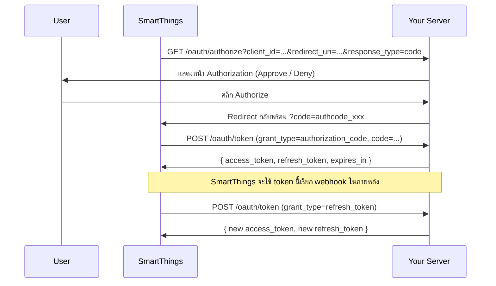

# SmartThings Schema — OAuth 2.0 Credentials

ค่าที่ต้องกรอกในหน้า **Register New Schema App** ของ SmartThings Developer Workspace:

> [!IMPORTANT]
> URL ด้านล่างจะใช้งานได้ต่อเมื่อเปิด server ผ่าน public URL เช่น ngrok, Cloudflare Tunnel, หรือ deploy ขึ้น server จริงแล้ว
> ตัวอย่างใช้ `https://your-domain.com` — ให้แทนด้วย URL จริงของคุณ

## Credentials สำหรับกรอก

| Field | Value |
|---|---|
| **Client ID** | `9fd328674014587b3bb32535a4090fc7` |
| **Client Secret** | `2fe97a54dd662eb92311f7beed1a20b66b5db599d18bc47b3f4c46f11ba270ed` |
| **OAuth URL** | `https://your-domain.com/oauth/authorize` |
| **OAuth Scope** | `imou:cameras` |
| **Token URI** | `https://your-domain.com/oauth/token` |
| **Alert Notification Email** | *(ใส่ email ของคุณ)* |

## ถ้าใช้ ngrok สำหรับ development

```bash
# เปิด ngrok เพื่อ tunnel port 3600
ngrok http 3600
```

สมมุติ ngrok ให้ URL `https://abc123.ngrok-free.app` → จะกรอกค่าเป็น:

| Field | Value |
|---|---|
| **OAuth URL** | `https://abc123.ngrok-free.app/oauth/authorize` |
| **Token URI** | `https://abc123.ngrok-free.app/oauth/token` |

## OAuth 2.0 Flow Diagram



## Files Created/Modified

| File | Description |
|---|---|
| [oauth.js](file:///d:/Work/App/ImouXSmartThings/src/smartthings/oauth.js) | OAuth 2.0 Authorization Server (authorize + token endpoints) |
| [tokenStore.js](file:///d:/Work/App/ImouXSmartThings/src/oauth/tokenStore.js) | Persistent token store (JSON file) |
| [.env](file:///d:/Work/App/ImouXSmartThings/.env) | OAuth credentials added |
| [config.js](file:///d:/Work/App/ImouXSmartThings/src/config.js) | OAuth config updated |

> [!NOTE]
> Tokens ถูกเก็บใน `data/oauth-tokens.json` (auto-created) และจะ persist ข้าม server restart
> ไฟล์ `data/` ถูกเพิ่มเข้า `.gitignore` แล้ว เพื่อไม่ให้ token หลุดเข้า git

